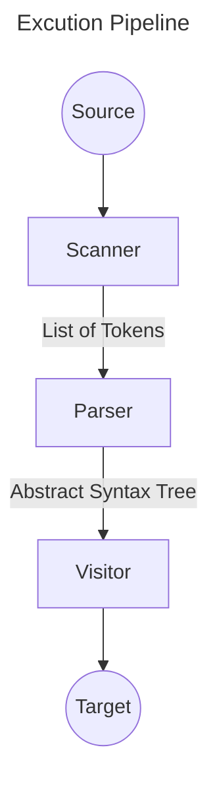
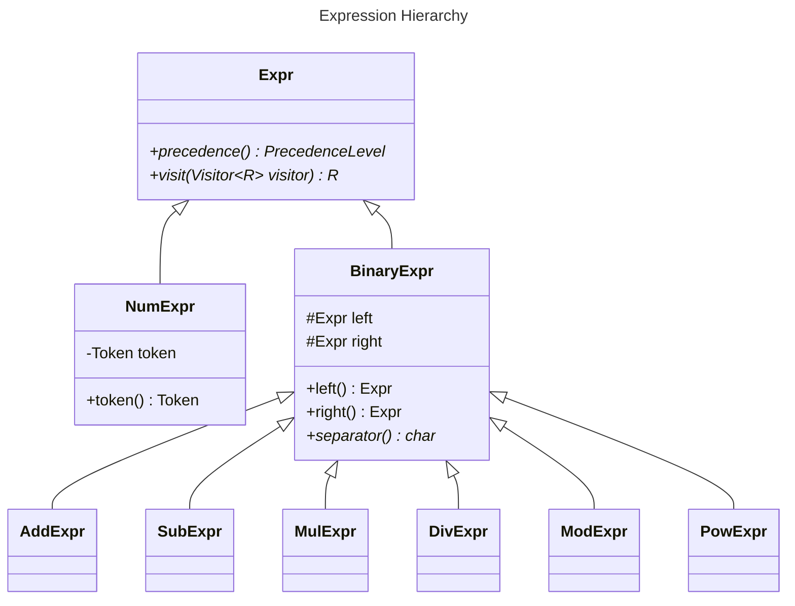

# IFJe Project
## Arithmetic Expression Generator
---

## Technical Support

This assignment was developed in Java 17 and uses the gradle build system.

### Running on [Merlin](merlin.fit.vutbr.cz)

Gradle has a built-in wrapper a.k.a. `gradlew` that is responsable to determine
all the required dependencies. All the project dependencies are specified in
the [app/build.gradle.kts](app/build.gradle.kts) file.

Only Java Platform is needed to execute the program. 
In addition, tests also require JUnit Jupyter.

> [!IMPORTANT]
> At the time of writing Merlin seems to do not work very well with `gradlew`
> because of the location of the JDK in the filesystem. Therefore, this project
> includes a jar file that make it possible to run the program on Merlin.

If you are able to spin up `gradlew` then running the program, from the project
root, is as simple as:

```sh
$ ./gradlew run
```

> [!NOTE]
> There are also targets for testing and building.
> See all of them with `$ ./gradle tasks`

If for some reason, `gradlew` does not work you can also try:

```sh
$ java -jar app/build/libs/app.jar
```

### Usage

The program reads an input program from the standard input and prints the
equivalent expression to the standard output.

This way it is possible to use the program with much more flexibility using
unix pipes:

```sh
echo in.txt | ./generator
```

> [!NOTE]
> Please substitute `./generator` with the commands presented in the subsection
> above.

## Implementation Details & Other Considerations

The implementation tries to closely follow what is described in the assignment
description. 

It contains features such as error handling and also tries to minimize
the number of parenthesis according to the precedence and associativity of 
operations. It also adds parenthesis when negative numbers can cause ambiguity,
e.g `add(3, sub(-10, -5))` generates `3 + (-10 - (-5))`

### Implementation Architecture

The flow of execution of the program can be describes as a pipeline:



Also, regarding the representation of the *Abstract Syntax Tree* there is the
following class hierarchy:



## References

1. Lecture notes
2. The book *Crafting Interpreters*
    1. Available [here](https://craftinginterpreters.com)

## Author

[xboave00](mailto:256039@fit.vutbr.cz)

